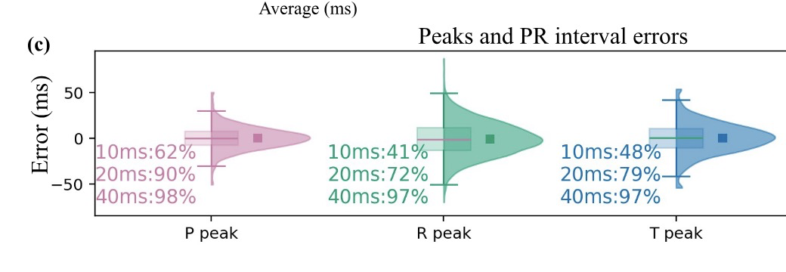

# Prompt for Code Agent: Generate Publication-Quality Result Figures for MMECG LOSO Experiments

Please generate the final publication-quality figures for my paper based on the experimental results of **two models**:

- **Baseline:** `radarODE-MTL`
- **Ours:** `BeatAware slim` (label this as **Ours** in all figures)

The experiments are conducted under a **strict 11-fold LOSO (leave-one-subject-out)** protocol on the **MMECG** dataset.

The test subjects are:

- `S1, S2, S5, S9, S10, S13, S14, S16, S17, S29, S30`

The physiological conditions are:

- `NB` = Normal Breathing
- `IB` = Irregular Breathing
- `PE` = Post-Exercise
- `SP` = Sleep

Please generate the following figures with consistent visual style suitable for a high-quality journal paper. Use clean layout, readable font sizes, consistent legends, and consistent color assignment across figures.

---

# General plotting requirements

## Style
- Use a clean, publication-quality style.
- Keep colors consistent across all figures:
  - `radarODE-MTL` = one consistent color
  - `Ours` = one consistent color
- Use large readable axis labels, tick labels, and legends.
- Use tight layout and avoid unnecessary clutter.
- Export each figure as a high-resolution image (PNG and/or PDF).

## Data conventions
- Use **test results only**.
- Use **subject-independent LOSO evaluation results**.
- Use the appropriate aggregation level exactly as specified for each figure.
- If some subject-condition combinations are missing, display them as `N/A` or leave them masked appropriately (do **not** fill with zero).

## Metric naming
Please use the following naming consistently in figure labels/titles:
- `PCC ↑`
- `PRD ↓`
- `RR interval error (ms) ↓`
- `QT interval error (ms) ↓`

---

# Figure 1. Subject × Condition PCC Heatmap

## Goal
Show reconstruction performance across **subjects** and **conditions** using **median PCC**.

## Layout
Create **2 subplots**:

- **(a)** `radarODE-MTL PCC heatmap`
- **(b)** `Ours PCC heatmap`

## Axes
- **x-axis:** test subjects  
  `S1, S2, S5, S9, S10, S13, S14, S16, S17, S29, S30`
- **y-axis:** conditions  
  `NB / IB / PE / SP`

## Cell value
Each cell should be:

- the **median PCC** of all test segments for that **subject × condition** pair

## Important details
- Use the **same color scale** for (a) and (b).
- Show the numeric value inside each cell if possible.
- Missing subject-condition pairs should be shown clearly as `N/A` or masked.
- Title example:
  - `(a) radarODE-MTL`
  - `(b) Ours`

---

# Figure 2. Subject-Independent Comparison (Grouped Bar Charts)

## Goal
Compare the two models at the **subject level** under LOSO.

## Layout
Create **4 subplots** in a **2 × 2 layout**:

- **(a)** `PCC ↑`
- **(b)** `PRD ↓`
- **(c)** `RR interval error (ms) ↓`
- **(d)** `QT interval error (ms) ↓`

## x-axis
For all four subplots:

- **x-axis:** test subjects  
  `S1, S2, S5, S9, S10, S13, S14, S16, S17, S29, S30`

## Plot type
Use **grouped bar charts**:
- two bars per subject:
  - `radarODE-MTL`
  - `Ours`

## Aggregation rule
For each **subject** and each **metric**:
- **bar height** = **median** across all test segments of that subject
- **error bar** = **standard deviation (Std)** across all test segments of that subject

## Additional annotation
In the **top-right corner** of each subplot, annotate the **overall median improvement**, e.g.:

- `Median Δ = +0.061`

Use the following improvement definitions:
- For **PCC**: `Ours - radarODE-MTL`
- For **PRD / RR error / QT error**: `radarODE-MTL - Ours`

So that a positive Δ always means improvement by Ours.

## Legend
Use a legend to distinguish:
- `radarODE-MTL`
- `Ours`

---

# Figure 3. ECDF Distribution Analysis

## Goal
Show whether Ours improves performance at the **segment level distribution**, not only at the subject median level.

## Layout
Create **2 subplots**:

- **(a)** `PCC ECDF`
- **(b)** `QT interval error ECDF`

## Data extraction
Use **all test segments from all LOSO folds**, with **no subject-level aggregation**.

That is:
- `radarODE-MTL_values = all radarODE-MTL test segments`
- `ours_values = all Ours test segments`

## Metrics
- For subplot (a): use **segment-level PCC**
- For subplot (b): use **segment-level QT interval error**

## Plot type
Use **ECDF curves**:
- one curve for `radarODE-MTL`
- one curve for `Ours`

## Interpretation
- For `PCC`, better curves should shift **to the right**
- For `QT interval error`, better curves should shift **to the left**

## Axes
- **(a) x-axis:** `PCC`
- **(a) y-axis:** `Cumulative proportion`
- **(b) x-axis:** `QT interval error (ms)`
- **(b) y-axis:** `Cumulative proportion`

---

# Figure 4. Representative Waveform Reconstruction Examples

## Goal
Show qualitative waveform reconstruction examples across four physiological conditions.

## Layout
Create **4 subplots** in a **2 × 2 layout**:

- **(a)** `NB`
- **(b)** `IB`
- **(c)** `PE`
- **(d)** `SP`

## Curves to plot in each subplot
Plot the following three waveforms:

- `Ground-truth ECG`
- `radarODE-MTL reconstruction`
- `Ours reconstruction`

## Data extraction
For each candidate segment, the following information is needed:
- `subject_id`
- `condition`
- `segment_id`
- `gt_ecg`
- `pred_radarODE-MTL`
- `pred_ours`
- `pcc_radarODE-MTL`
- `pcc_ours`

## Representative segment selection
Please use the following criterion:

### Recommended selection rule: median improvement case
For each condition:
1. Compute  
   `delta_pcc = ours_pcc - radarODE-MTL_pcc`
2. Compute the **median** of `delta_pcc` for that condition
3. Select the segment whose `delta_pcc` is **closest to the median(delta_pcc)**

This avoids cherry-picking and gives a representative example.

## Axes
- **x-axis:** `Time (s)`
- **y-axis:** `Normalized ECG amplitude`

## Optional zoom-in
If possible, add a **zoomed inset** in each subplot:
- show a **2-second local window**
- recommended window: around one R peak
- e.g. from **R peak - 0.4 s** to **R peak + 0.8 s**

## Figure style
- Make sure all three waveforms are visually distinguishable.
- Use a clear legend.
- Keep all four panels visually aligned.

---

# Figure 5. Condition-Wise Robustness Analysis

## Goal
Show whether Ours is more robust across different physiological conditions.

## Important note
This figure should compare **both models**, not Ours alone.

## Layout
Create **3 subplots**:

- **(a)** `PCC by condition`
- **(b)** `PRD by condition`
- **(c)** `QT interval error by condition`

## Aggregation level
Use **subject-condition-level aggregation**:

1. First compute the **median metric** for each  
   `model × subject_id × condition`
2. Then plot the resulting distributions

So each point represents:

- **one subject-condition median**

## Plot type
Use either:
- **grouped boxplots with jittered points**, or
- **grouped violin plots with jittered points**

Preferred:
- clean grouped **boxplots + jittered points**

## Axes
- **x-axis:** `NB / IB / PE / SP`
- **hue:** `radarODE-MTL` vs `Ours`

## y-axis
- subplot (a): `PCC ↑`
- subplot (b): `PRD (%) ↓`
- subplot (c): `QT interval error (ms) ↓`

## Important details
- Keep colors consistent with previous figures.
- Show individual subject-condition points.
- If possible, indicate the number of available subject-condition pairs in the caption or x-label notes.

---

# Figure 6. Q/R/S/T Peak Timing Error Analysis of the Proposed Model

## Goal
Provide a fine-grained fiducial timing analysis for **the proposed model only**.

## Important note
This figure should show **Ours only**.

## Plot type
Use **violin plots**.

## Layout
Create **4 subplots** (or one compact multi-violin panel if visually cleaner), corresponding to:

- **(a)** `Q peak timing error`
- **(b)** `R peak timing error`
- **(c)** `S peak timing error`
- **(d)** `T peak timing error`

## Data
Use the predicted fiducial timing results of **Ours** only.

## Error definition
Use timing error in **milliseconds**.

If possible:
- plot the **signed error distribution**
- but compute the threshold percentages using **absolute error**

## Required annotation
For each violin, annotate the percentage of samples satisfying:

- `≤10 ms: xx%`
- `≤20 ms: xx%`
- `≤40 ms: xx%`

That is, for each fiducial type, compute:
- percentage of samples with `|error| <= 10 ms`
- percentage of samples with `|error| <= 20 ms`
- percentage of samples with `|error| <= 40 ms`

## Style reference
Please use the attached reference image as a style reference for this figure:
- violin shape
- side annotation format
- clear percentage display

## Recommended details
- Overlay median / IQR if possible.
- Keep the layout clean and publication-ready.
- y-axis label: `Error (ms)`

---

# Figure captions / naming suggestions

Use publication-style captions and titles. Suggested figure names:

- **Figure 1.** Subject × Condition PCC heatmaps for radarODE-MTL and the proposed model.
- **Figure 2.** Subject-independent LOSO comparison between radarODE-MTL and the proposed model.
- **Figure 3.** Segment-level ECDF analysis of PCC and QT interval error.
- **Figure 4.** Representative ECG reconstruction examples under four physiological conditions.
- **Figure 5.** Condition-wise robustness analysis across physiological states.
- **Figure 6.** Q/R/S/T peak timing error analysis of the proposed model.

---

# Final deliverables

Please generate:
1. all figures
2. high-resolution saved files
3. if possible, the plotting scripts as separate reusable Python files

Please also ensure:
- consistent style across all figures
- clean legends
- readable font sizes
- no overlapping labels
- correct aggregation level for each figure
- clear separation between subject-level, segment-level, and subject-condition-level analyses